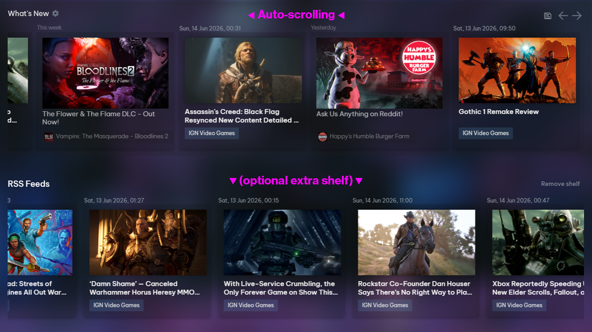

# What's New RSS Ticker

A Millennium plugin that combines Steam Library's **What's New** articles with
RSS/Atom feeds and displays them as a continuously scrolling ticker.

## Requirements and Theme Compatibility

> [!IMPORTANT]
> An applied Millennium theme is required. This plugin does not work with
> Steam's unthemed default interface.

The plugin has been tested with:

- [SpaceTheme for Steam](https://steambrew.app/theme/zQndv1rI0FXLh3QTRgOL)
- [Fluenty](https://steambrew.app/fluenty-steam)

Other Millennium themes may work, but have not been tested.

## Features

- Scrolls articles from right to left and loops continuously.
- Pauses while an article or Steam dialog is open.
- Resumes automatically when the dialog closes.
- Restores Steam's native previous/next pagination when an arrow is clicked.
- Resumes ticker mode after a configurable delay (10 seconds by default).
- Configurable speed from 10 to 200 pixels per second.
- Adds and removes RSS or Atom feed URLs from Millennium settings.
- Displays RSS entries as What's New cards and opens them in a Library overlay.
- Shows configurable exact publication dates and times above RSS cards.
- Adds a newspaper button beside the What's New settings cog for browsing all
  currently loaded Steam and RSS articles in one scrollable grid.
- Displays Steam articles followed by newest RSS entries, or alternates a
  configurable number of RSS articles between Steam articles.
- Limits loaded RSS articles with a configurable maximum of 20 by default.
- Uses the native carousel arrows to page across the combined Steam and RSS list.
- Provides an RSS-only shelf through Library Home's Add Shelf menu.
- Can show RSS articles exclusively on that separate shelf instead of What's New.
- Refreshes feeds when the Library is reopened, after an article closes, and at
  a configurable interval (60 minutes by default).
- Caches the last successful feed response so temporary network failures do not
  remove existing articles.
- Preserves article markup and skin styling; only ticker layout properties are
  applied.

## Usage

Install and apply a compatible Millennium theme, enable
**What's New RSS Ticker**, and restart Steam when prompted. Then open
Millennium settings and select **What's New RSS Ticker** to adjust the ticker
and RSS feed settings.

RSS feeds are downloaded by the Millennium backend so feeds do not need to
permit browser cross-origin requests. A feed that fails remains listed with an
error, while any previously cached articles stay available.
